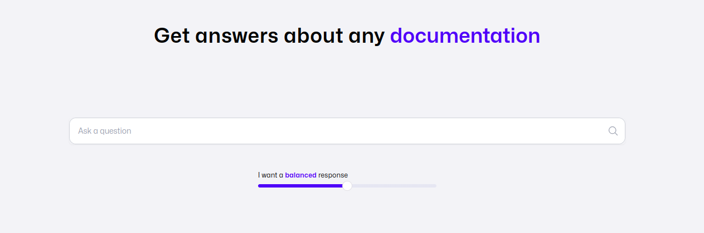

## TLDR

Manu is the most comprehensive productivity tool for software developers.
It includes the best parts of google search, claude and github copilot, focused on developers.

From finding code snippets, to understanding a new library, to getting started on a new codebase, manu answers from the most general to the most ___ questions.

## Long story

Manu appeared from the struggles that we as developers encountered every day.

Like always jumping from google to stack overflow, or checking MDN, or going through github issues for that specific error code.
For quick answers, google has worked really well. Then ChatGPT came and we found a faster way of getting an answer without needing to sift through SEO content. But sometimes, you don't need to start a whole new chat.

### Search
In the last years, it has become more confusing to find quick answers to questions as more websites are fighting with SEO to capture queries.
We can always rely on that Stack overflow answer that we new answers our questions, but we need to go through Google every time to find it.

Ideally the documentation sites for libraries, frameworks or APIs would be enough, but the challenges with these are:
- you need google every time to go back to them
- every doc site is different, so the interface may not always be very UX friendly
- docs might be out of date

We built questions so developers have a single place where to get quick answers to any technical query.

Be it a quick example of a native JavaScript API or a longer explanation about hooks in React, developers get quick answers (with references back to the original documentation) so they don't have to jump through 3 websites to reach the same point.

<Card title="About questions" icon="magnifying-glass" href="/getting-started/questions">
  How manu help developers get quick answers to the most challenging questions
</Card>

### Chat

ChatGPT and Claude have proven extremely useful to developers. Asking follow up questions to get an answer specifically for our problem is godsend. 

The challenge with these products is they need to support a lot of use cases: marketing copy, customer service and even [applying for jobs](https://www.reddit.com/r/GetEmployed/comments/1eo8uyp/i_used_ai_to_automatically_apply_for_1000_jobs/).

Manu is built specifically for developers, for use-cases that devs have.

The chat feature is currently built with this in mind and will evolve to cover more needs that appear during development.

<Card title="About chat" icon="message" href="/getting-started/chats">
  Chat is the most powerful way to get quick help for your exact question.
</Card>

### Projects

The big problems with AI chat apps is that they don't have the context of their users. They have very good knowledge of public information found online.

This is even more important for developers where things like private repos or project dependencies are essential to the conversation and they should nudge the code assistant into giving the right answer.

We tried to cover that case with [projects](/getting-started/projects). You can connect manu to our github repos so it will know about your codebase and dependencies and give the most relevant answers.

<Card title="About projects" icon="folder" href="/getting-started/projects">
  Projects are chats on steroids. Ask questions about your private repo or only add our dependencies to get the most relevant answers.
</Card>

### More to come

We are actively developing manu and we'll add features monthly. If you have feedback for us please reach out :pray:
