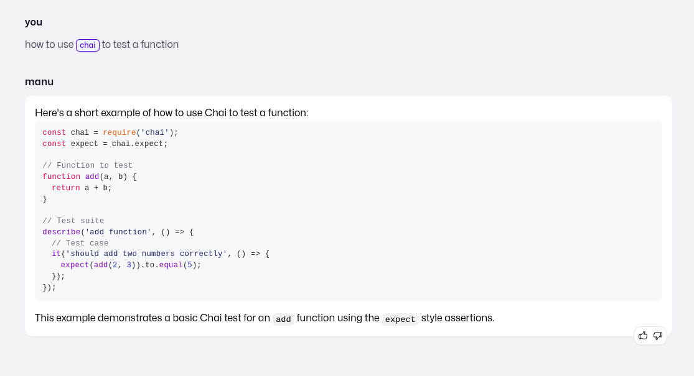
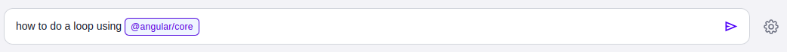
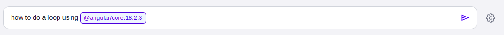

## About chats
Chats are a really powerful tool to get to the answer you need. Asking follow up questions until you make sure you fully got what you needed.

## Features

### Relevant

manu uses [Sonnet 3.5](https://www.anthropic.com/news/claude-3-5-sonnet) from Anthropic to generate responses. It has proven many times that is the most powerful model for coding or coding related tasks.

More so, we've indexed documentation from popular npm packages (more package managers coming soon) so you get back references to the original docs that were used when generating the answer.

### Chat about a specific library

You can mention a specific library by using  `@`  so you get answers that are related to it or include it.

You can also specify a certain version by typing `:` after:

Creating the right context for manu is the best way to get the most out of it and specifying the libraries you are using makes sure the answers are extremely relevant to you.

### Control the answer returned

With chat you can control how manu should respond. If you feel like having a short, to the point conversation with it, you can use the top slider to control the length of the response returned.

<video autoPlay muted loop src="../videos/chat-response.mp4"></video>

You can also control the amount of comments that the generated snippets or code contains.

We will be adding more controls soon so you get the perfect style of conversation you need.
