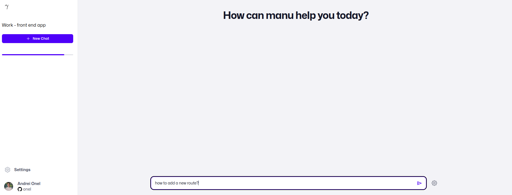
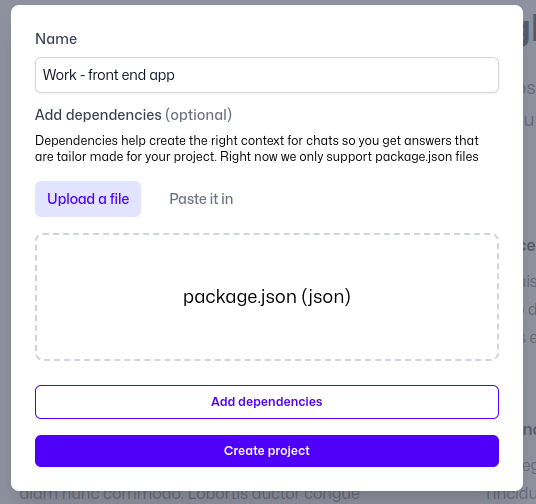
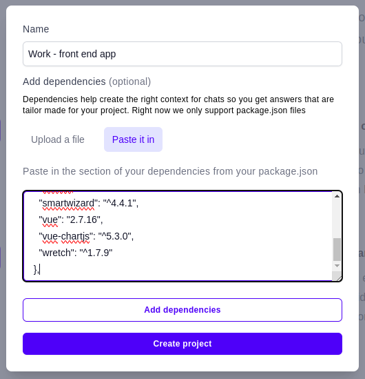

## About projects

Projects are chats but with everything that is specific to you in their context.

Be it project dependencies, private code repo (or even public ones), projects help you get answers that are specific to a particular environment.

## Features

### Add dependencies

The dependencies of a project is the simplest and safest way to add context to a chat without sharing the actual code base.

You can add dependencies to a project by:

1. uploading your `package.json` file
2. pasting in the `development` section from`package.json`

manu will use these dependencies to look for the most recent version of that library that respects your constraints, and adds those libs to chats context.

The downside of this is that you will have to update the project's dependencies every time they change.

That's why connecting to a private repo will always keep them up to date, read more 👇

### Chat with a private repo (coming soon) `Pro`

Asking question about the private repo is the fastest to get the insight needed to:

- get up to speed on a new code base
- start implementing a new feature
- find the right file/function to update

It's like having a senior developer pair program with you. One with infinite patience.

### Chat with a public repo (coming soon) `Pro`

Chatting with a new repo is a god send when starting out to contribute to open source. That's why manu will help new and old contributers get things done faster.

Also, sometimes the docs for a library might not be enough, or their outdated.

Jumping in the code and asking how things are implemented is extremely useful when wanting to integrate that library in your own projects.

<Note>We love and rely on open source a lot at manu. We plan to make this feature free in the near future.</Note>
