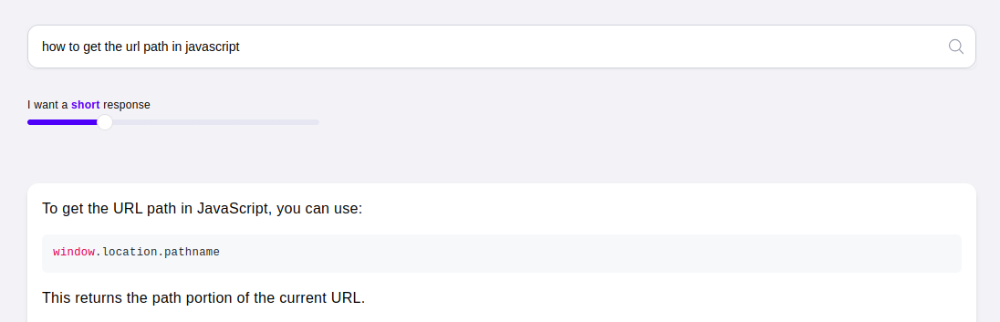
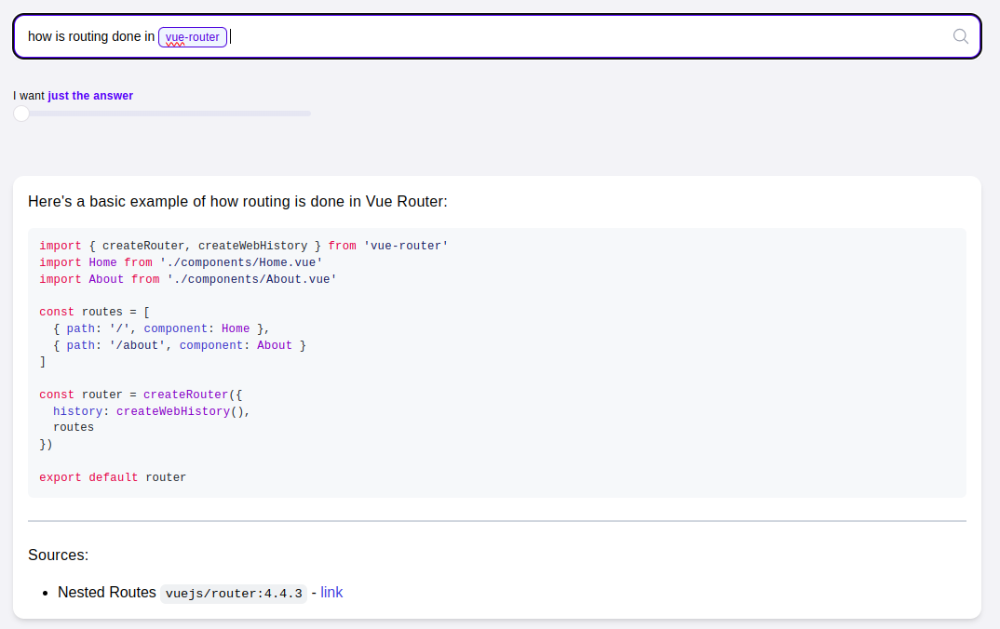
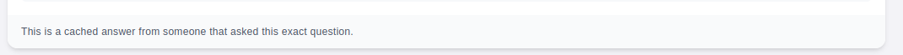
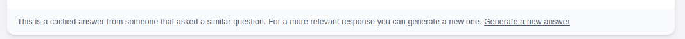

Sometimes a quick answer is all you need

## About questions

Chat are powerful tools to get the answers that devs need. But sometimes, you just need a quick reminder about how to use that API in javascript and a whole chat would be an overkill.

We built [Questions](https://askmanu.co/question) with that in mind: get quick answers so you unblock quickly.

Think of Questions as Perplexity, but for devs.

## Features

### Relevant

manu uses [Sonnet 3.5](https://www.anthropic.com/news/claude-3-5-sonnet) from Anthropic to generate answers for questions. It has proven many times that is the most powerful model for coding or coding related queries.

More so, we've indexed documentation from popular npm packages (more to come soon) so you get back references to the original docs that were used when generating an answer.

### Search for a specific version

A pain that we encounter sometime is when we find a great answer / blogpost online for a problem we have and it is not for the version of the library that we are using. With manu, you can specify exactly the version that you want to be used when generating an answer:

<Frame caption="Asking a question for a specific version">
  
</Frame>

<Frame caption="If no version is specified, we use that latest available">
  
</Frame>

### Fast

We cache answers from other users that have asked the same question (or a similar one) to get you the quickest response possible.

If you search for an question that is very similar to an asked question, we will also return a cached response. If you feel that that answer is not relevant, you can generate a new one specifically for your question.

### Follow up questions

If the answer you got is helpful but you want to ask follow up questions, you can turn it into a chat and continue the conversation

